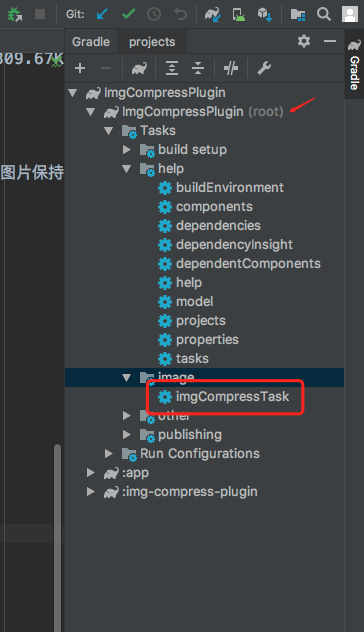

### ImgCompressPlugin

* * *
一款Android端gradle插件,一键扫描项目中的资源目录并进行批量图片压缩,提供3种压缩方式,支持有损及无损压缩.同时会记录已压缩的文件,适合个人及团队协同使用.


### 如何使用
第一步:在`Project`的build.gradle文件中:

```
buildscript {
    repositories {
        jcenter()
    }
    dependencies {
        ...
        classpath 'com.kingkingdu.plugin:img-compressor:版本号'
    }
}
...
...
//图片压缩插件配置
apply plugin: 'img-compressor'
imgCompressOpt{
    way="pngquant"
    test = false
    whiteFiles=["text_pic1.png","test_pic2.jpg"]
    minSize=5
    tinyKeys=["your key"]
}

```
第二步:引入后点击`sync now`,gradle配置完毕后会显示下图`imgCompressTask`,双击即可执行,等待压缩结果即可


#### 配置信息
- `way`:设置压缩的方式,支持3种常见的压缩,"tinypng","pngquant","zopflip" 3选1,压缩方式选择及压缩效果见下图
- `test`:设置测试模式是否开启,false表示压缩后图片直接覆盖原图,true表示会把原图及压缩图输出到测试目录(Project/ImageCompressTest)
- `whiteFiles`:选填,白名单文件数组,不进行压缩
- `minSize`:单位为KB,设置原图大于某个数值才触发压缩,0表示全部都压缩
- `tinyKeys`:选填,仅在way="tinypng"情况下才需要
#### gradle task点击指南

### 压缩效果

| 原图 | tinypng | pngquant | zopflip |
| --- | --- | --- | --- |
| 压缩类型 | 有损 | 有损 | 无损 |
| 1.3M | 445KB | 542KB |903KB |
|  | .png) | .png) | .png) |


### 如何选择合适的压缩方式
- 如果项目本身原先使用的压缩方式与3种模式之一相同,则way选择相同的方式.
- 如果原先没有固定的压缩方式,那么推荐使用tiny或者pngquant,相对来说,tiny压缩时间较长,需要去官网申请key,但效果最好.pngquant压缩快速,效果也不错

### 白名单的意义
- 当进行图片压缩后发现有少量图片失真,则可以加入白名单,避免被压缩
### 测试模式

### 最佳实践
- 引入本插件,配置测试模式test=false,初次执行`imgCompressTask`后,查看log,会打印类似日志:
    - Task finish, compressed:3 files  skip:3 Files  before total size: 951.50KB after total size: 309.67KB save size: 641.83KB
    - 通过日志可得知被压缩图片为3个,跳过图片为3个,图片压缩前后的大小比较.图片跳过的原因为图片已充分压缩,无需再压缩

- 执行task后会在project目录下生成image-compressed-info.json文件,记录了已压缩的图片信息
- 通过Android studio自带的版本控制对比压缩前后图片是否失真,将失真图片(一般很少)加入白名单中,同时revert恢复原图
- 将image-compressed-info.json文件加入到版本控制,提交修改后的图片及json文件
- 在后续的版本开发中,团队中的任何人在开发过程中加入任何图片,或者等版本提测后,执行一次task即可压缩新版本引入的图片,旧版本的图片保持不变,也不会出现团队成员重复压缩的情况

### 问题解答
- Q1:如果在后续版本迭代过程中,已压缩的图片替换成新的图片,会不会忘记压缩了
- 答:不会.插件本身会通过MD5进行校验,而不是图片命名进行校验,故新图片也会执行压缩的
- Q2:支持的图片格式有哪些?
- 答:支持png,jpg格式,webp暂时不支持
- Q3:对于组件化项目存在多个module,是否会扫描所有的module?
- 答:会全部扫描,只要是application类型或者Android library类型都会被扫描到


### 支持的系统
在macOS、windows10上测试通过

### 参考
[chenenyu](https://github.com/chenenyu/img-optimizer-gradle-plugin)
### License

[Apache 2.0](http://www.apache.org/licenses/LICENSE-2.0.html)
